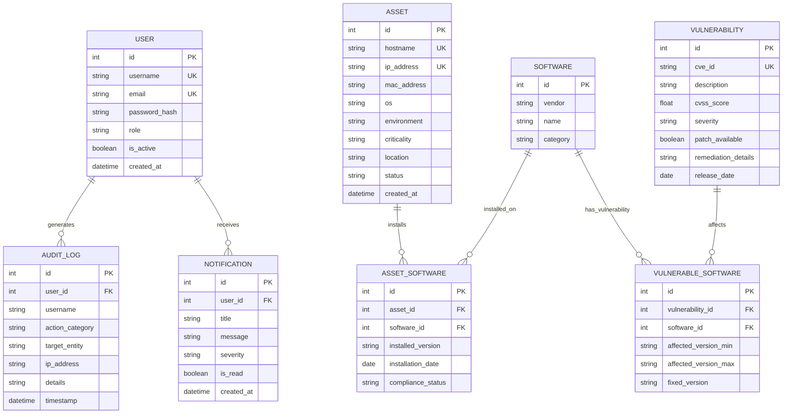
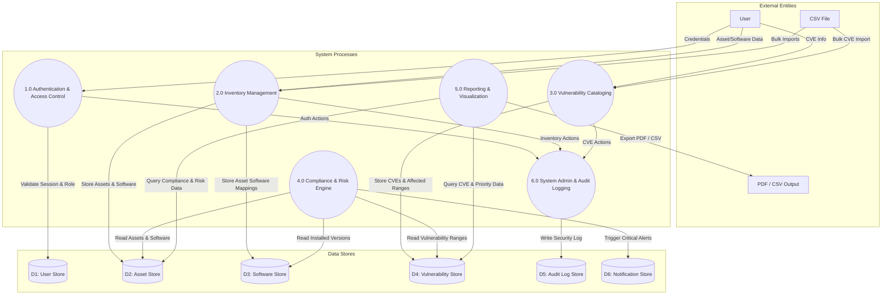
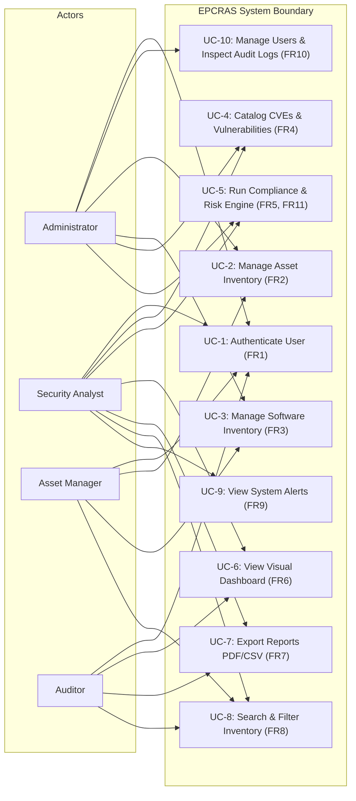
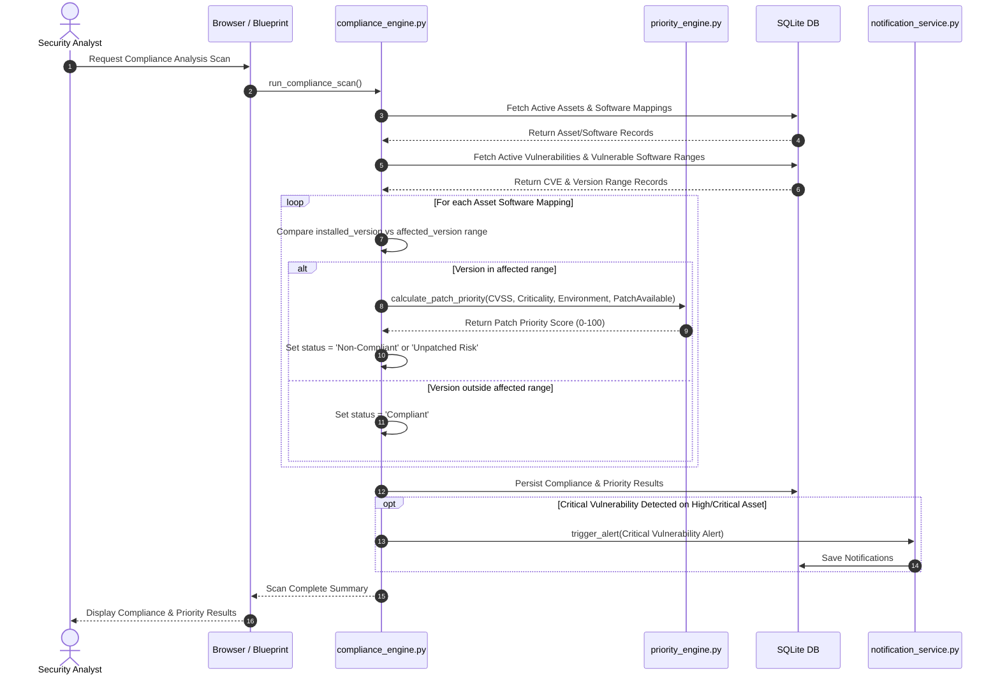
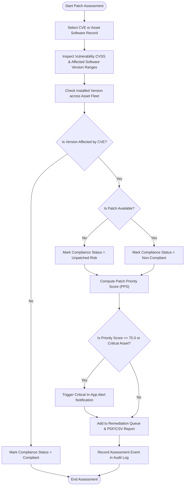

# System Design Document
## Enterprise Patch Compliance and Risk Assessment System (EPCRAS)

---

### 1. Executive Summary & Architectural Principles

EPCRAS is designed as a lightweight, modular, monolithic web application using Python Flask, Flask-SQLAlchemy, Flask-Login, Flask-WTF, SQLite, Bootstrap 5, and Chart.js. 

#### Core Architectural Principles
1. **Modular Monolith**: Organized into Flask Blueprints with strict separation between HTTP routing and underlying business logic services.
2. **Server-Side Enforcement**: All authorization (RBAC), data validation, risk scoring, and compliance calculations are executed strictly server-side.
3. **Decoupled Business Logic**: Route handlers perform input parsing, delegate work to specialized service components, and render templates or JSON responses.
4. **Low Resource Overhead**: Native SQLite database engine and efficient in-memory processing optimized for single-machine deployment on low-resource hardware.

---

### 2. Intended Package and Directory Structure

The repository directory layout is structured as follows:

```
epcras/
├── docs/
│   ├── SRS.md
│   └── design.md
├── src/
│   └── epcras/
│       ├── __init__.py               # Flask application factory (create_app)
│       ├── config.py                 # Configuration settings (Development, Testing, Production)
│       ├── extensions.py             # Instantiated Flask extensions (db, login_manager, csrf)
│       ├── models/                   # SQLAlchemy Data Models
│       │   ├── __init__.py
│       │   ├── user.py               # User & Role models
│       │   ├── asset.py              # Asset model
│       │   ├── software.py           # Software & AssetSoftware models
│       │   ├── vulnerability.py      # Vulnerability & VulnerableSoftware models
│       │   ├── notification.py       # Notification model
│       │   └── audit.py              # AuditLog model
│       ├── services/                 # Decoupled Business Logic Services
│       │   ├── __init__.py
│       │   ├── auth_service.py       # User auth & RBAC helpers
│       │   ├── asset_service.py      # Asset CRUD & business rules
│       │   ├── software_service.py   # Software inventory & CSV parsing
│       │   ├── vulnerability_service.py # CVE management & CSV parsing
│       │   ├── compliance_engine.py  # Patch compliance matching engine
│       │   ├── priority_engine.py    # Patch Priority Scoring (PPS) algorithm
│       │   ├── dashboard_service.py  # Analytics aggregation for charts & metrics
│       │   ├── report_service.py     # PDF (ReportLab) and CSV report generation
│       │   ├── search_service.py     # Unified multi-criteria search & filtering
│       │   ├── notification_service.py # System alerts & notification dispatcher
│       │   ├── admin_service.py      # User management logic
│       │   └── audit_service.py      # Append-only audit logger
│       ├── routes/                   # Flask Blueprints / Controller Layer
│       │   ├── __init__.py
│       │   ├── auth.py               # auth_bp
│       │   ├── asset.py              # asset_bp
│       │   ├── software.py           # software_bp
│       │   ├── vulnerability.py      # vulnerability_bp
│       │   ├── compliance.py         # compliance_bp
│       │   ├── dashboard.py          # dashboard_bp
│       │   ├── report.py             # report_bp
│       │   ├── search.py             # search_bp
│       │   ├── notification.py       # notification_bp
│       │   └── admin.py              # admin_bp
│       ├── forms/                    # Flask-WTF Form Definitions & Validations
│       │   ├── __init__.py
│       │   ├── auth_forms.py
│       │   ├── asset_forms.py
│       │   ├── software_forms.py
│       │   ├── vulnerability_forms.py
│       │   └── admin_forms.py
│       ├── static/                   # Frontend Static Assets
│       │   ├── css/
│       │   │   └── custom.css        # Custom styles over Bootstrap 5
│       │   └── js/
│       │       ├── main.js           # Shared Vanilla JS helpers & AJAX CSRF setup
│       │       └── charts.js         # Chart.js initialization & dynamic updates
│       └── templates/                # Jinja2 HTML Templates
│           ├── base.html             # Master layout template (Navbar, Flash alerts)
│           ├── errors/               # 403, 404, 500 error templates
│           ├── auth/                 # Login template
│           ├── dashboard/            # Executive dashboard template
│           ├── assets/               # Asset list, detail, form templates
│           ├── software/             # Software list, detail, import templates
│           ├── vulnerabilities/      # CVE catalog & import templates
│           ├── compliance/           # Compliance overview & priority list templates
│           ├── reports/              # Report generation templates
│           ├── search/               # Search interface templates
│           ├── notifications/        # Notification center template
│           └── admin/                # Admin user management & audit log templates
├── tests/                            # Automated Pytest Suite
│   ├── conftest.py                   # Test fixtures (app, db, client, authenticated users)
│   ├── unit/                         # Unit tests for services & models
│   │   ├── test_auth.py
│   │   ├── test_asset.py
│   │   ├── test_software.py
│   │   ├── test_vulnerability.py
│   │   ├── test_compliance.py
│   │   ├── test_priority.py
│   │   ├── test_report.py
│   │   ├── test_search.py
│   │   └── test_audit.py
│   └── integration/                  # Integration tests for routes & RBAC security
│       ├── test_auth_routes.py
│       ├── test_asset_routes.py
│       ├── test_compliance_routes.py
│       └── test_admin_routes.py
├── instance/                         # Local SQLite database files (git-ignored)
├── requirements.txt                  # Python dependencies
└── run.py                            # Application entry point script
```

---

### 3. System Architecture

EPCRAS follows a 4-tier layered architecture within a monolithic deployment:

```mermaid
flowchart TD
    subgraph ClientLayer ["Client Layer (Browser)"]
        UI ["Bootstrap 5 / Vanilla JS / Chart.js"]
    end
    subgraph WebLayer ["Flask Web Application Layer"]
        Blueprints ["Flask Blueprints / Routing"]
        AuthMiddleware ["Flask-Login & RBAC Middleware"]
        Forms ["Flask-WTF Forms & CSRF Validation"]
    end
    subgraph ServiceLayer ["Business Logic & Service Layer"]
        AuthSvc ["auth_service.py (FR1)"]
        AssetSvc ["asset_service.py (FR2)"]
        SoftSvc ["software_service.py (FR3)"]
        VulnSvc ["vulnerability_service.py (FR4)"]
        CompEngine ["compliance_engine.py (FR5)"]
        PrioEngine ["priority_engine.py (FR11)"]
        DashSvc ["dashboard_service.py (FR6)"]
        ReportSvc ["report_service.py (FR7)"]
        SearchSvc ["search_service.py (FR8)"]
        NotifSvc ["notification_service.py (FR9)"]
        AdminSvc ["admin_service.py & audit_service.py (FR10)"]
    end
    subgraph DataLayer ["Data Access & Storage Layer"]
        ORM ["Flask-SQLAlchemy ORM"]
        DB [("SQLite Database")]
    end

    UI --> Blueprints
    Blueprints --> AuthMiddleware
    AuthMiddleware --> Forms
    Forms --> ServiceLayer
    ServiceLayer --> ORM
    ORM --> DB
```

---

### 4. Module Decomposition & Traceability to SRS

| Module Name | File Location | Responsibility | SRS Requirement Traceability |
| :--- | :--- | :--- | :--- |
| **Authentication Module** | `src/epcras/routes/auth.py`<br>`src/epcras/services/auth_service.py` | Handles login/logout, password verification, session management, and RBAC decorators (`@role_required`). | **FR1** User Authentication |
| **Asset Management Module** | `src/epcras/routes/asset.py`<br>`src/epcras/services/asset_service.py` | Manages IT asset records, validation of unique hostnames/IPs, and lifecycle status. | **FR2** Asset Management |
| **Software Inventory Module** | `src/epcras/routes/software.py`<br>`src/epcras/services/software_service.py` | Catalogs software products, tracks installed versions on assets, handles bulk CSV imports. | **FR3** Software Inventory |
| **Vulnerability Database Module**| `src/epcras/routes/vulnerability.py`<br>`src/epcras/services/vulnerability_service.py` | Manages CVE records, CVSS scores, affected software version ranges, and CSV import. | **FR4** Vulnerability Database |
| **Compliance Engine Module** | `src/epcras/routes/compliance.py`<br>`src/epcras/services/compliance_engine.py` | Compares asset software versions against CVE version ranges, evaluating compliance status. | **FR5** Patch Compliance Analysis |
| **Patch Priority Engine** | `src/epcras/services/priority_engine.py` | Computes Patch Priority Score (0-100) using CVSS, asset criticality, exposure, and patch status. | **FR11** Patch Priority Engine |
| **Dashboard Module** | `src/epcras/routes/dashboard.py`<br>`src/epcras/services/dashboard_service.py` | Aggregates system metrics, compliance summary statistics, and formatted data for Chart.js. | **FR6** Dashboard |
| **Report Generation Module** | `src/epcras/routes/report.py`<br>`src/epcras/services/report_service.py` | Generates downloadable PDF reports via ReportLab and raw data exports via CSV. | **FR7** Report Generation |
| **Search & Filter Module** | `src/epcras/routes/search.py`<br>`src/epcras/services/search_service.py` | Multi-criteria search query builder spanning assets, software, and vulnerabilities. | **FR8** Search and Filtering |
| **Notifications Module** | `src/epcras/routes/notification.py`<br>`src/epcras/services/notification_service.py` | Dispatches and persists in-app alerts for critical vulnerabilities and security events. | **FR9** Notifications |
| **Admin & Audit Module** | `src/epcras/routes/admin.py`<br>`src/epcras/services/admin_service.py`<br>`src/epcras/services/audit_service.py` | User creation, role assignment, and immutable append-only security event logging. | **FR10** Administration & Audit Logs |

---

### 5. User Roles and Permissions

EPCRAS implements four distinct operational roles enforced via server-side decorators (`@login_required`, `@role_required(...)`):

#### Role Permission Matrix

| Capability / Resource | Administrator | Security Analyst | Asset Manager | Auditor |
| :--- | :---: | :---: | :---: | :---: |
| **User Account Management (Create, Edit Roles)** | **FULL** | Denied | Denied | Denied |
| **System Audit Logs Inspection** | **FULL** | Denied | Denied | Denied |
| **Asset Management (Create, Edit, Delete)** | **FULL** | Read-Only | **FULL** | Read-Only |
| **Software Inventory (Catalog, Link, Import CSV)**| **FULL** | Read-Only | **FULL** | Read-Only |
| **Vulnerability Database (CVE Add, Edit, Import)** | **FULL** | **FULL** | Read-Only | Read-Only |
| **Trigger Compliance & Priority Engine** | **FULL** | **FULL** | Read-Only | Read-Only |
| **View Dashboard & Perform Search** | **FULL** | **FULL** | **FULL** | **FULL** |
| **Export Compliance Reports (PDF / CSV)** | **FULL** | **FULL** | Read-Only | **FULL** |
| **View & Clear Personal Notifications** | **FULL** | **FULL** | **FULL** | **FULL** |

---

### 6. Security Boundaries & Protection Mechanisms

```
[ Client Browser ] --- (HTTPS/HTTP + CSRF Header) ---> [ Flask Web Application ]
                                                               |
                                                  [ Auth & RBAC Interceptor ]
                                                               |
                                                  [ Parameterized ORM Layer ]
                                                               |
                                                    [ SQLite DB File ]
```

1. **Authentication Boundary**: Protected by Flask-Login with secure cookie session handling (`HttpOnly`, `SameSite=Lax`).
2. **Authorization Boundary**: Custom `@role_required` decorator validates role claims against server-side session before executing endpoint logic.
3. **Data Access Boundary**: All SQL queries execute through SQLAlchemy ORM object queries or parameterized statement bindings, preventing SQL Injection.
4. **CSRF Boundary**: Flask-WTF enforces CSRF token verification on all state-changing HTTP requests (`POST`, `PUT`, `DELETE`).
5. **Output Escaping Boundary**: Jinja2 auto-escaping turned on globally to block Cross-Site Scripting (XSS).
6. **Audit Boundary**: Security-relevant actions trigger `audit_service.log_event(...)`, writing immutable log records.

---

### 7. Entity-Relationship (ER) Model



---

### 8. Data Flow Diagrams (DFD)

#### 8.1 DFD Level 0 (Context Diagram)

```mermaid
flowchart TD
    subgraph ExternalEntities ["External Entities"]
        Users ["System Users (Admin, Analyst, Asset Mgr, Auditor)"]
        CSVFiles ["CSV Data Imports (Assets / Software / CVEs)"]
    end

    subgraph EPCRAS ["EPCRAS System Boundary"]
        SystemProcess (("0. EPCRAS Main Application Process"))
    end

    subgraph Reports ["External Output"]
        PDFCSVExports ["PDF Audit Reports / CSV Downloads"]
    end

    Users -- "Login credentials, asset data, CVE entries, filter requests" --> SystemProcess
    CSVFiles -- "Bulk Asset / Software / CVE CSV Files" --> SystemProcess
    SystemProcess -- "Rendered UI views, charts, alert notifications" --> Users
    SystemProcess -- "Generated PDF / CSV Reports" --> PDFCSVExports
```

#### 8.2 DFD Level 1



---

### 9. Major Workflows & Behavioral Models

#### 9.1 Use Case Diagram



#### 9.2 Sequence Diagram: Compliance & Patch Priority Analysis



#### 9.3 Activity Diagram: Vulnerability-to-Patch Assessment Workflow



---

### 10. Requirement Traceability Matrix (System Design to SRS)

| Component / Module | Design Artifact / Class | SRS Functional Requirement | Verification / Test Strategy |
| :--- | :--- | :--- | :--- |
| `auth.py` / `auth_service.py` | `User` Model, `login_user()`, `@role_required` | **FR1** User Authentication & RBAC | `test_auth.py`, `test_auth_routes.py` |
| `asset.py` / `asset_service.py` | `Asset` Model, `create_asset()`, `update_asset()` | **FR2** Asset Management | `test_asset.py`, `test_asset_routes.py` |
| `software.py` / `software_service.py` | `Software`, `AssetSoftware` Models, CSV Importer | **FR3** Software Inventory | `test_software.py` |
| `vulnerability.py` / `vulnerability_service.py` | `Vulnerability`, `VulnerableSoftware` Models | **FR4** Vulnerability Database | `test_vulnerability.py` |
| `compliance.py` / `compliance_engine.py` | `run_compliance_scan()`, `compare_versions()` | **FR5** Patch Compliance Analysis Engine | `test_compliance.py`, `test_compliance_routes.py` |
| `dashboard.py` / `dashboard_service.py` | `get_dashboard_metrics()`, Chart JSON APIs | **FR6** Visual Dashboard | Integration test for dashboard endpoints |
| `report.py` / `report_service.py` | `generate_pdf_report()`, `generate_csv_report()` | **FR7** Report Generation | `test_report.py` |
| `search.py` / `search_service.py` | `search_all()`, Filter Builder | **FR8** Search and Filtering | `test_search.py` |
| `notification.py` / `notification_service.py` | `Notification` Model, `create_notification()` | **FR9** Notifications System | Unit tests for alert dispatching |
| `admin.py` / `admin_service.py` / `audit_service.py` | `AuditLog` Model, `log_event()`, User Management | **FR10** Administration & Audit Logs | `test_admin.py`, `test_admin_routes.py`, `test_audit.py` |
| `priority_engine.py` | `calculate_patch_priority()` | **FR11** Patch Priority Engine | `test_priority.py` |
